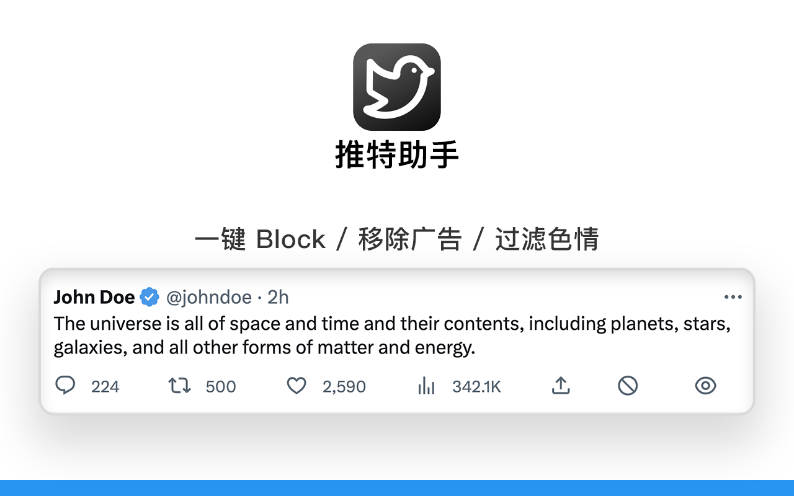

    

    
     

    中文 | <a href="/README-en.md">English</a>

## Changelog

### Version 0.3.0
- 增加更换旧 Logo 的功能

### Version 0.2.0
- 完善评论下色情图片的过滤机制
- 更新误检测为色情图的机制
- 优化检测效率
- Bug 修复

<h2>About</h2>
Copyright © Haojen 2023